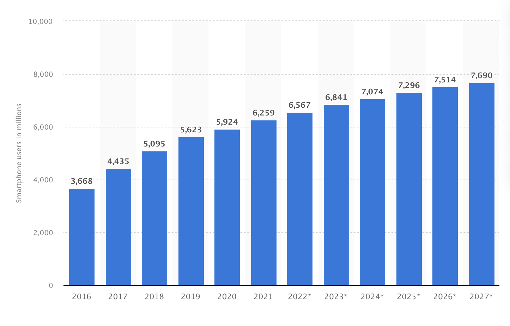

```{r setup, include=FALSE}
knitr::opts_chunk$set(echo = TRUE)
```


\pagebreak
\tableofcontents
\pagebreak

# Introduction
Mobile phones have become widely available in the past couple years. This availability has allowed a surge in the number of users worldwide. To elaborate on this point, in 2022 there were 6.6 billion registered smartphones @Statista. To put this number into perspective, the world population in 2022 is around 7.9 billion @worldpopulation. That means that around 83% of the world population owns a smartphone. Of course, we are not accounting for people with multiple smartphones and other factors. To further exaggerate the growth in the number of smartphones, only 6 years ago in 2016 the number of active smartphones were around 3.7 billion. These facts are all driven by the fact that mobile phones are becoming an essential tool for the majority of people, whether they use it as a means of communication, entertainment, work, or other uses. In this project, a data set containing multiple variables including the variable price range is presented. We will be using discriminant analysis to classify observations into their respective classes.

{width=370px}


# About the Data
The data presented contains information related to mobile phones. It contains 21 variables, 14 of these are quantitative, 6 are binary, and 1 is categorical. The data is already split into training and testing. The training data contains 2000 observations. The testing data contains 1000 observations, however, it does not contain the class variable. Therefore, we will not be able to use it to calculate external classification error, and we will have to split our training data into training and testing again.
\newline
\par
\noindent
The data is obtained from the kaggle website, linked below.
\newline
\par
\noindent
Source: \url{https://www.kaggle.com/datasets/iabhishekofficial/mobile-price-classification}

## Variables
\begin{itemize}
    \item Battery power - Total energy a battery can store in one time in mAh. This is a quantitative variable.
    \item Blue - Whether the phone has bluetooth or not. This is a qualitative binary variable i.e. 0 or 1.
    \item Clock speed - Speed at which the processor executes instructions in GHz. This is a quantitative variable.
    \item Dual sim - Whether the phone has dual sim support or not. This is a qualitative binary variable.
    \item Fc - Front camera megapixels. One megapixel is a million pixels. This is a quantitative variable.
    \item Four g - Whether the phone has 4g or not. This is a qualitative binary variable.
    \item Int memory - Internal memory in GB. This is a quantitative variable.
    \item M dep - Mobile depth in cm. This is a quantitative variable.
    \item Mobile wt - Weight of mobile phone in grams. This is a quantitative variable.
    \item N cores - Number of cores of the processor. This is a quantitative variable.
    \item Pc - Primary camera megapixels. This is a quantitative variable.
    \item Px height - Pixel resolution height. This is a quantitative variable.
    \item Px width - Pixel resolution width. This is a quantitative variable.
    \item Ram - Random access memory in MB. This is a quantitative variable.
    \item Sc h - Screen height of mobile in cm. This is a quantitative variable.
    \item Sc w - Screen width of mobile in cm. This is a quantitative variable.
    \item Talk time - Longest time that a single battery charge will last when you are using the calling someone on the phone. This is a quantitative variable.
    \item Three g - Has 3g or not. This is a qualitative binary variable.
    \item Touch screen - Has a touch screen or not. This is a qualitative binary variable.
    \item Wifi - Has wifi or not. This is a qualitative binary variable.
    \item Price range - Low cost (0), medium cost (1), high cost (2), and very high cost (3). This is a qualitative categorical variable.
\end{itemize}

## Some Remarks Regarding the Data

Below is an initial look at the data. The data does not contain any missing values. We will be using all 21 variables and the class variable price range to perform discriminant analysis.
```{r echo=F}
train = read.csv("train.csv")
knitr::kable(head(train[,1:12],2))
knitr::kable(head(train[,12:21],2))
```

```{r include=F}
sum(is.na(train))
```

```{r include=F}
# https://stackoverflow.com/questions/17171148/non-redundant-version-of-expand-grid
# used to get the combinations of plots to look at since pairs() is overwhelmed by the 210 plots
expand.grid.unique <- function(x, y, include.equals=FALSE)
{
    x <- unique(x)

    y <- unique(y)

    g <- function(i)
    {
        z <- setdiff(y, x[seq_len(i-include.equals)])

        if(length(z)) cbind(x[i], z, deparse.level=0)
    }

    do.call(rbind, lapply(seq_along(x), g))
}

combinations = expand.grid.unique(1:21,1:21)
# WARNING: 210 graphs will be printed if you uncomment and run for loop below
#for(i in 1:210){
#  plot(train[,combinations[i,1]],train[,combinations[i,2]],xlab = colnames(train)[combinations[i,1]],ylab=colnames(train)[combinations[i,2]])
#}
```

```{r include=F}
#for (i in 1:20){
#  plot(train[,i],train[,21],xlab=colnames(train)[i],ylab = colnames(train)[21])
#}
```

# Problem Statement
The aim of this analysis is to compare the results of Fishers Linear Discriminant Analysis (FLDA) and Multinomial Random Variable (MRV). In addition, we would like to classify new observations. We will try both FLDA and MRV and decide which is most suitable for classifying the data at hand.

# Assumptions

## Normality

To satisfy the normality assumption in Fisher Linear Discriminant Analysis, we must transform the variables so that they follow a normal distribution. In Figure 2, 3, and 4 we can see that none of the variables follow a normal distribution.
```{r echo=F, fig.align='center', fig.cap="Histograms of All Variables", warning=FALSE, out.width="70%"}
par(mfrow=c(2,4))
for (i in 1:8){
  hist(train[,i],main=colnames(train)[i],xlab=colnames(train)[i])
}
```


```{r echo=F, fig.align='center', fig.cap="Histograms of All Variables", warning=FALSE, out.width="70%"}
par(mfrow=c(2,4))
for (i in 9:16){
  hist(train[,i],main=colnames(train)[i],xlab=colnames(train)[i])
}
```


```{r echo=F, fig.align='center', fig.cap="Histograms of All Variables", warning=FALSE, out.width="70%"}
par(mfrow=c(2,4))
for (i in 17:21){
  hist(train[,i],main=colnames(train)[i],xlab=colnames(train)[i])
}
```


### Transformations

```{r include=F, echo=F}
#train %>% summarise_if(is.numeric, min)
```

Adding ten to the variables with 0 values in order to allow the log transformation.
```{r}
add_one = c('blue','dual_sim','fc','four_g','pc','px_height','sc_w','three_g','touch_screen','wifi','price_range')
for(i in add_one){
  train[,i] = train[,i] + 10
}
```

We then perform the necessary transformations. They are shown below. We can also see in Figure 5 the distribution of these variables after transformation.
\begin{align*} 
Front Camera &= log(FrontCamera) \\ 
MobileDepth &= log(MobileDepth) \\
NumberofCores &= log(NumberofCores \\
ScreenWidth &=log(ScreenWidth) \\
ScreenHeight &=log(ScreenHeight) \\
ClockSpeed &= log(ClockSpeed) \\
PixelHeight &= \sqrt{PixelHeight}
\end{align*}

```{r include=F}
train[,'fc'] = log(train[,'fc'])
train[,'m_dep'] = log(train[,'m_dep'])
train[,'clock_speed'] = log(train[,'clock_speed'])
train[,'n_cores'] = log(train[,'n_cores'])
train[,'px_height'] = sqrt(train[,'px_height'])
train[,'sc_w'] = log(train[,'sc_w'])
train[,'sc_h'] = log(train[,'sc_h'])
```

```{r echo=F, fig.align='center', fig.cap=" Transformation of Variables", warning=FALSE, out.width="70%"}
knitr::opts_chunk$set(fig.pos = 'H')
par(mfrow=c(2,4))
columns_transformed = c('px_height','sc_w','clock_speed','fc','m_dep','n_cores','sc_h')
for (i in columns_transformed){
  hist(train[,i],main=i,xlab=i)
}
```

The transformations in Figure 5 are not perfectly normally distributed, however, we are trying to approach a normal distribution as much as possible. Therefore, we perform the transformations regardless of whether we reach a perfect normal distribution or not. To conclude, the assumption of normality is not valid for all variables.

\pagebreak

## Equal Variance
The assumption of equal variance-covariance matrices for all classes will be relaxed, therefore, we assume the following.

\begin{align*} 
\Sigma_{0}=\Sigma_{1}=\Sigma_{2}=\Sigma_{3}
\end{align*}

Where the subscript represents the price range: low cost (0), medium cost (1), high cost (2), and very high cost (3).

# Classification

## Fisher Linear Discriminant Analysis

```{r include=FALSE}
library(MASS)
flda=function(x,class){
cat("Fisher Linear Discriminant:\n")
a = lda(x, class); d = predict(a)
t=table(class, d$class);
er=100*(sum(t)-sum(diag(t)))/nrow(x)
#cat("Error Rate =",er,"%\n")
return(list(t=t,er=er,d=d))
}
```

### Internal Classification
We perform linear discriminant analysis. As we can see in the confusion matrix Table 3, there are 98 internally misclassified observations. Therefore, the internal misclassification rate is 4.9%.
```{r echo=F}
fl = flda(train[,-21],train[,21])
knitr::kable(fl$t,caption="Confusion Matrix (Internal)")
```

```{r echo=F}
cat("Internal Classification Error Rate =",fl$er,"%\n")
```

### Training and Testing

We split the data into training and testing in order to compute external misclassification. The training set contains 1500 observations while the testing set contains 500 observations.
```{r}
# Shuffling data
set.seed(1652001)
s = sample(1:2000,1500,replace=F)
new_train = train[s,]
new_test = train[-s,]
```

```{r include=F}
d = lda(new_train[,-21],new_train[,21])
p = predict(d,new_test[,-21])
t = table(p$class,new_test[,21])
```

We use the model to compute the confusion matrix Table 4 for the testing set. We find that the external misclassification error is 5.4%. Out of 500 observations in the testing set 27 were misclassified. The external misclassification is higher than internal misclassification, which is logical. However, the internal misclassification is computed on the whole data \(n=2000\) while the external is computed on \(n=500\). The fact that the two error rates are not too far off from each other is a good sign. In addition, an error rate less than 10% is sufficient for classification in my opinion.
```{r echo=F}
knitr::kable(t,caption="Confusion Matrix (External)")
cat("External Misclassification Error:",100*(sum(t)-sum(diag(t)))/nrow(new_test),"%")
```

### Leave One Out
We also attempt the leave one out method for cross validation. In this case, we will be using the whole data. The number of runs is \(n=2000\).
```{r}
loo=function(x,class){
  n=length(class)
  rslt={}
  for(i in 1:n){
     a = lda(x[-i,], class[-i])
     b = predict(a,x[i,])
     rslt[i]=b$class #[i]==class[i]
  }
return(rslt)
}
```

```{r echo = F}
rslt = loo(train[,-21],train[,21])
```

We can see in Table 5 that the off diagonal elements are 112 observations. Therefore, we have 112 misclassifications out of 2000 observations.
```{r echo = F}
t = table(rslt,train[,21])
knitr::kable(t,caption="Confusion Matrix (External - Leave One Out)")
```

The misclassification error is 5.6%, which is higher than when we split the data into training and testing sets. Therefore, we conclude that splitting the data into training and testing is superior to the leave one out method in this case and results in a lower misclassification rate 5.4% compared to 5.6%.
```{r echo = F}
cat("Leave One Out External Misclassification Error:",100*(sum(t)-sum(diag(t)))/nrow(train),"%")
```

## Multinomial Random Variables
Now we will be using the multinomial distribution to classify observations.
```{r include=T}
library(nnet)
mn = multinom(price_range ~ ., data = train)
results = predict(mn)
```

### Internal Classification
We compute the confusion matrix. As can be seen from Table 6, there are 40 misclassified observations out of 2000 observations.
```{r echo=F}
t = table(train$price_range, results)
knitr::kable(t,caption="Confusion Matrix (Internal)")
```
The internal misclassification error is 2%, which is lower than the one obtained from FLDA 4.9%.
```{r echo=F}
cat("Internal Misclassification Error:",100*(sum(t)-sum(diag(t)))/nrow(train),"%")
```

### Training and Testing

Now splitting our data into training and testing again. We find the classification error is lower than FLDA when we split the data into training and testing.
```{r include=F}
mn = multinom(price_range ~ ., data = new_train)
results = predict(mn,new_test[,-21])
t = table(results,new_test[,21])
```

The off diagonal elements sum is 25 observations. Out of 500 observations 25 were misclassified.
```{r echo=F}
knitr::kable(t,caption="Confusion Matrix (External)")
```
The external misclassification error is 5%, which is lower than FLDA's 5.4% in the same case. Also, the difference between the internal misclassification error 2% and external misclassification error 5% is large compared to the difference observed in FLDA.
```{r echo=F}
cat("External Misclassification Error:",100*(sum(t)-sum(diag(t)))/nrow(new_test),"%")
```

### Leave One Out
```{r echo=F}
loo_mn=function(x,class){
  n=length(class)
  rslt={}
  for(i in 1:n){
     mn = multinom(price_range ~ ., data = train[-i,])
     b = predict(mn,x[i,])
     rslt[i]=b[1] #[i]==class[i]
  }
return(rslt)
}

```

Finally, we will be applying the leave one out method for multinomial random variables.
```{r include=FALSE}
results_mn = loo_mn(train[,-21],train[,21])
t = table(results_mn,train[,21])
```
Using the leave one out method for the multinomial distribution we get 74 misclassifications out of 2000 observations.
```{r echo=F}
knitr::kable(t,caption="Confusion Matrix (External - Leave One Out)")
```

The misclassification error is 3.7%, the lowest out of all the external classifications measured. In addition, it is lower than the external misclassification error for training and testing. This is the opposite of what we observed in FLDA.
```{r echo = F}
cat("External Misclassification Error:",100*(sum(t)-sum(diag(t)))/nrow(train),"%")
```

# Conclusion

In the table below we can see that the Multinomial Random Variable (MRV) out performs FLDA. MRV has a lower error rate for all three tests. The last row with the variable \(n\) represents the number of observations in the training set. We conclude that given new data regarding mobile phone price ranges. We will be using MRV to classify observations into the relevant price range. It's important to note that MRV outperforms FLDA in this case and that in some other cases FLDA may be superior. Also, we did not satisfy the assumptions of FLDA. Finally, we should note that the difference between the external classification when splitting the data into training and testing is not that much. Splitting the data into training and testing is the most practical use case. For FLDA the misclassification rate is 5.4% and MRV it is 5%, so the difference is not too significant.

```{r echo=F}
m = matrix(c('4.9%','5.4%','5.6%','2%','5%','3.7%','2000','1500','1999'),ncol=3,byrow=T)
colnames(m) <- c('Internal Misclassification Error','Training and Testing (External Misclassification Error)','Leave One Out (External Misclassification Error)')
rownames(m) <- c('FLDA','MRV','n')
tab <- as.table(m)
knitr::kable(tab,caption="Comparing Methods", booktabs=T)
```


# References
\bibliography{bib}
\bibliographystyle{plain}