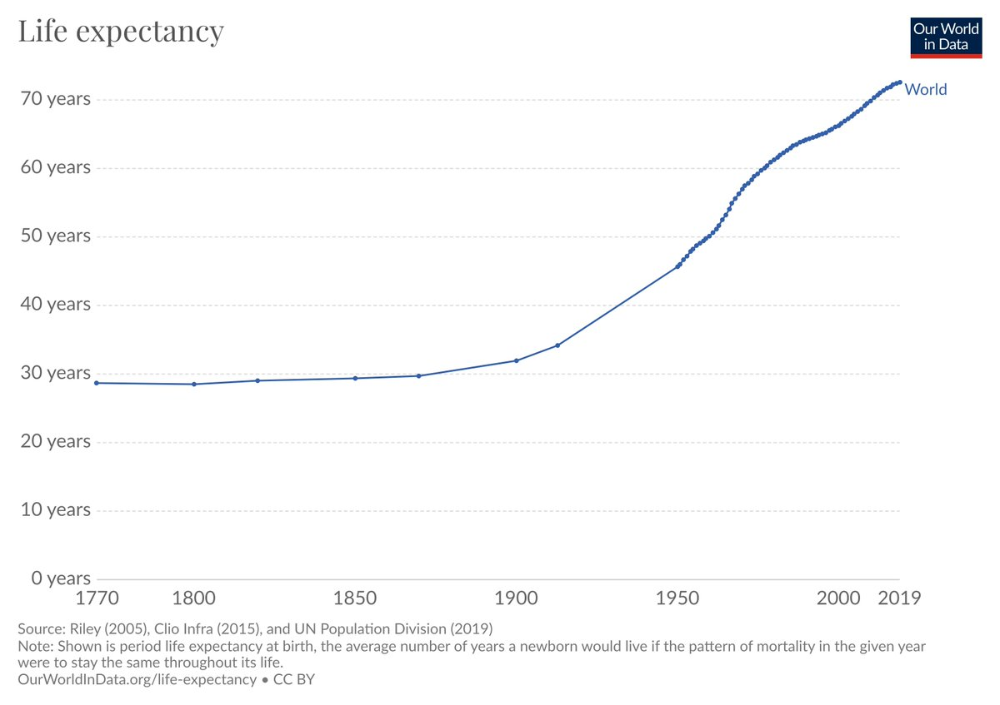
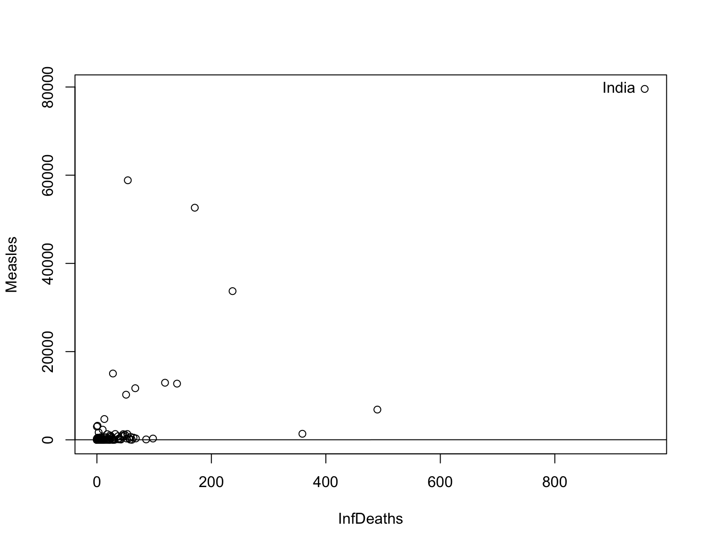
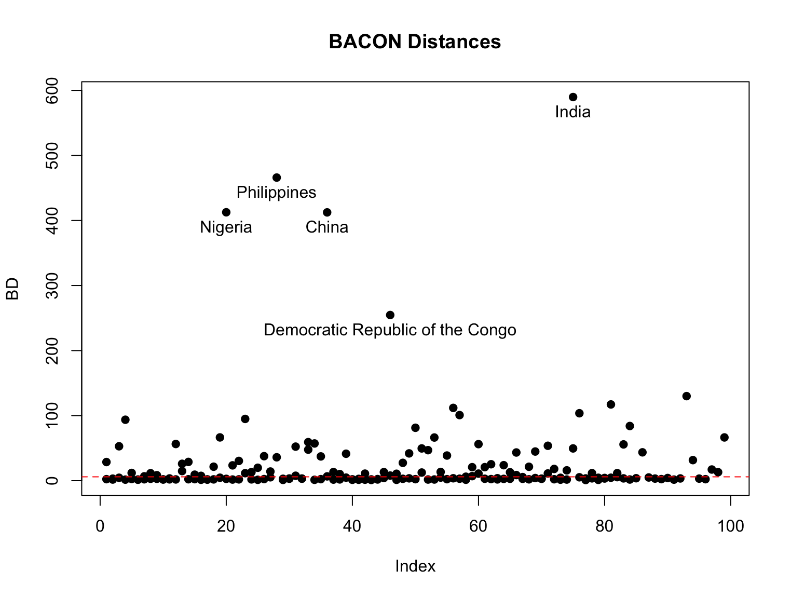

```{r setup, include=FALSE}
knitr::opts_chunk$set(echo = TRUE)
```
\pagebreak
\tableofcontents
\pagebreak
# Introduction
An important metric that represents the overall health of a population is the life expectancy. Life expectancy is the average age of death. It is a more general metric than infant and child mortality and captures mortality along the entire life course, @owidlifeexpectancy. According to @owidlifeexpectancy since 1900 the average life expectancy has more than doubled and is currently above 70 years old. Higher life expectancy may also indicate higher quality of life. After a thorough analysis of the data, we find that the average life expectancy in developed countries is higher than developing countries.

{width=350px}

# About the Data
The data presented contains information related to life expectancy for 193 countries. It was collected over 16 years, from 2001-2015. It contains 2938 observations and 22 variables. After an initial look at the data we find some missing values and observations.
\newline
\par
\noindent
The data was collected from the World Health Organization (WHO) and the United Nations (UN) websites with the help of Deeksha Russell and Duan Wang.
\newline
\par
\noindent
Source: \url{www.kaggle.com/datasets/kumarajarshi/life-expectancy-who}
\newline
\par
\noindent

## Variables
\begin{itemize}
    \item Country - Country name as a string e.g. Afghanistan.
    \item Year - The year the data was collected. It is a quantitative variable.
    \item Status - The status of the country. Either developing or developed. It is a categorical variable.
    \item Life Expectancy - The life expectancy in age. It is a quantitative variable.
    \item Adult Mortality - The number of adults (between 15 years old and 60 years old) that are expected to die out of a 1000 people population. This is a quantitative variable.
    \item Infant Deaths - The number of infant deaths out of a 1000 people population. This is a quantitative variable.
    \item Alcohol - Alcohol, recorded per capita (15+) consumption (in litres of pure alcohol)
    \item Percentage Expenditure - Expenditure on health as a percentage of Gross Domestic Product (GDP) per capita. This is a quantitative variable.
    \item Hepatitis B - Percentage of immunization among 1 year olds for Hepatitis B. This is a quantitative variable.
    \item Measles - The number of reported cases for measles from a 1000 people population. This is a quantitative variable.
    \item BMI - The average of the Body Mass Index (BMI) for the whole population. This is a quantitative variable.
    \item Under Five Deaths - The number of deaths under five years old out of a 1000 people population. This is a quantitative variable.
    \item Polio - Percentage of immunization among 1 year olds for Polio. This is a quantitative variable.
    \item Total Expenditure - General government expenditure on health as a percentage of total government expenditure. This is a quantitative variable.
    \item Diphtheria - Percentage of immunization among 1 year olds for Diphtheria tetanus toxoid and pertussis (DTP3). This is a quantitative variable.
    \item HIV/AIDS - Deaths per 1000 live births due to HIV/AIDS (0-4 years). This is a quantitative variable.
    \item GDP - Gross Domestic Product per capita in US Dollars. This is a quantitative variable.
    \item Population - Population of the country. This is a quantitative variable.
    \item Thinness 1-19 years - Prevalence of thinness among children and adolescents for age 10 to 19 as a percentage. This is a quantitative variable.
    \item Thinness 5-9 years - Prevalence of thinness among children for age 5 to 9 as a percentage. This is a quantitative variable.
    \item Income Composition of Resources - Human Development Index in terms of income composition of resources (index ranging from 0 to 1). This is a quantitative variable.
    \item Schooling - Number of years of schooling. This is a quantitative variable.
\end{itemize}

## Some Remarks Regarding the Data
Below is an initial look at the data.
```{r echo=FALSE}
df = read.csv("Life Expectancy Data.csv")
knitr::kable(head(df[,1:8],2))
knitr::kable(head(df[,9:16],2))
knitr::kable(head(df[,16:22],2))
```
In our analysis, we will only focus on observations collected in 2014. Therefore, some countries with no observations in 2014 will be omitted. The remaining observations are \(n=183\). Ten countries of the 193 in the data are not included in the analysis.

In addition, we will omit columns with missing values and the column that contains the year. We are left with \(p=11\). Below is a look at the first three rows of the final data we will be using. Of the 11 variables, 9 are quantitative, 1 is binary, and 1 contains the country name. The binary column Status, which represent whether a country is "Developed" or "Developing" will be converted to 0s and 1s. The original column will be dropped. The column Status is now called Developing.
```{r include=TRUE,echo=FALSE}
df_2014 = df[df[,2]==2014,] # taking only observations from 2014
df_2014 = df_2014[ , colSums(is.na(df_2014)) == 0] # removing columns with NA
df_2014$Developing = model.matrix( ~ Status - 1, data=df_2014 )[,2] # creating binary variable
df_2014 = df_2014[,-c(2,3)]
colnames(df_2014) <- c("Country","LifeExp","AdultMort","InfDeaths","PercExp","Measles","UnderFive","Polio","Diphtheria","HIV.AIDS","Developing")
row.names(df_2014) <- NULL
knitr::kable(head(df_2014[,1:6],3))
knitr::kable(head(df_2014[,7:11],3))
```

# Problem Statement
The data contains multiple variables that may influence life expectancy. Through the analysis of the data we have three goals:
\begin{itemize}
  \item Identify the variables that have the largest influence on life expectancy.
  \item Identify countries that may be considered outliers.
  \item Analyze the effect the variables have on each other.
\end{itemize}


\pagebreak
# Descriptive Statistics
Keep in mind that we will repeat the below analysis once our data is free from outliers since the mean and variance-covariance matrix are affected by outliers.
\newline
\newline
We can see a very clear negative linear relationship between life expectancy and adult mortality, which is expected. As the number of adult deaths decrease, the life expectancy decreases. There doesn't seem to be a relationship between life expectancy and percentage expenditure on health, however, there may still be a relationship after transformation. 
```{r, echo=F,out.width="70%",fig.cap="LifeExp vs AdultMort vs PercExp",fig.align='center'}
pairs(df_2014[,c(2,3,5)]) # LifeExp, AdultMort, PercExp
```
Now after using the log transformation on PercExp, we observe a linear relationship. We also find that the variance seems to be non constant due to the cone shape of the graph.
```{r echo=F,out.width="70%",fig.cap="LifeExp vs log(PercExp)",fig.align='center'}
pairs(data.frame(df_2014[,2],log(df_2014[,5])),labels = c("LifeExp","log(PercExp)"))
```

```{r echo=F,out.width="70%",fig.cap="AdultMort vs HIV.AIDS",fig.align='center'}
pairs(df_2014[,c(3,10)]) #AdultMort vs HIV.AIDS
```


\pagebreak

Firstly, we compute the vector of means. We find that the average life expectancy is around 71.5 years. The average adult mortality is 148.7, meaning that out of a 1000 person population of adults (15-60 years old), we expect 149 to die.
```{r include=TRUE,echo=FALSE}
knitr::kable(t(colMeans(df_2014[,2:11])),caption = "Vector of Means")
```
The number of infant deaths out of 1000 infants is expected to be 25. The number of deaths out of a population of 1000 people under the age of five is 33. Obviously the mean of deaths for the variable UnderFive is larger than the mean of InfDeaths. This is because infants (0-1 years old) are under the age of five and thus are included in the variable under five. This means that all values of InfDeaths are less than or equal to values of UnderFive, which is the case. In addition, when looking at Figure 5 we see a perfect linear relationship. This is expected since the values are the same in multiple cases and in other cases just shifted to the right by a couple values.
```{r echo=F,out.width="70%",fig.cap="InfDeaths vs Underfive",fig.align='center'}
plot(df_2014[,c(4,7)]) # InfDeaths vs Underfive
```
\pagebreak
A peculiar value is the percentage expenditure, which is the expenditure on health as a percentage of Gross Domestic Product (GDP) per capita. This value should be between 0 and 100, however, that is not the case. In addition, the average of the variable measles is over 1000. This should not be the case. The variable measles is defined as the number of reported cases for measles from a 1000 people population, therefore, its average should be less than or equal to 1000.

The variables Polio and Diphtheria represent the percentage of immunization among 1 year olds for these diseases. The values are close to each other. The average for Polio and Diphtheria respectively are 84.7 and 84.1. We can see in the figure Diphtheria vs Polio there seems to be a positive relationship. This may be because the two shots are administered at the same time.
\newline
\newline
```{r echo=F,out.width="70%",fig.align='center',fig.cap="Diphtheria vs Polio"}
plot(df_2014[,c(8,9)])
```
We also look at the mean of the variable HIV.AIDS, which is the deaths per 1000 births due to HIV/AIDS. It is 0.7, which is very small. Finally, the mean of the variable developing is 0.83, which means that around 83% of the countries in the data are developing countries.
```{r include=F,echo=FALSE}
# The covariance matrix \(\Sigma\)
cov = round(cov(df_2014[,2:11]),1)
library(kableExtra)
kable(cov, format="latex", booktabs=TRUE) %>% 
  kable_styling(font_size = 7,latex_options ="scale_down",full_width = T)
```


\pagebreak
Looking at the correlation matrix \(R\), we find some obvious as well as some weird values. A value we expect to see is the negative correlation between LifeExp and AdultMort which is -0.76 since we already identified this relationship from Figure 2.
```{r include=T,echo=FALSE}
cor = round(cor(df_2014[,2:11]),2)
library(kableExtra)
kable(cor, format="latex", booktabs=TRUE,caption = "Correlation Matrix") %>% 
  kable_styling(latex_options ="scale_down",full_width = T)
#%>%
#  row_spec(0, font_size=5)
```

```{r include=F, echo=F}
cor = round(cor(df_2014[,2:11]),2)
cor
```

In Figure 7 there seems to be a linear relationship, however, the points close to 0 for HIV.AIDS have a large influence on the regression line. These two variables have a correlation of -0.61. This relationship is obvious and is similar to LifeExp vs AdultMort.
```{r echo=F,out.width="70%",fig.align='center',fig.cap="HIV.AIDS vs LifeExp"}
reg1 = lm(df_2014$LifeExp~df_2014$HIV.AIDS)
plot(df_2014$HIV.AIDS,df_2014$LifeExp,xlab="HIV.AIDS",ylab="LifeExp")
abline(reg=reg1)
```

In Figure 8 we can see that the mean of LifeExp in developing countries is less than that of developed countries. In addition, the number of developed countries is far less than the number of developing countries.
```{r echo=F,out.width="70%",fig.align='center',fig.cap="LifeExp vs Developing"}
reg2 = lm(df_2014$LifeExp~df_2014$Developing)
plot(df_2014$Developing,df_2014$LifeExp,xlab="Developing",ylab="LifeExp")
abline(reg=reg2)
```
\pagebreak
The correlation coefficient between Measles and InfDeaths is 0.7. This value is extremely influenced by outliers. One very obvious outlier in Figure 9 is India with 8000 deaths. Keep in mind that this value should be the number of deaths due to measles from a 1000 person population.


{width=400px}

```{r echo=F,include=F, out.width="70%",fig.align='center',fig.cap="InfDeaths vs Measles"}
reg3 = lm(df_2014$InfDeaths~df_2014$Measles)
plot(df_2014$InfDeaths,df_2014$Measles,xlab="InfDeaths",ylab="Measles")
abline(reg3)
identify(df_2014$InfDeaths,df_2014$Measles,labels=df_2014$Country,)
```
\pagebreak
# Outliers

```{r,include=F}
# Eliptical Distances
edist = function(x){
  x = as.matrix(x)
  ev = eigen(var(x))
  d = diag(1/sqrt(abs(ev$values)))
  b = ev$vectors%*%d%*%t(ev$vectors)
  z = x%*%b
  d = dist(z);  return(d) }
ed = edist(df_2014[,2:11])
```

## Mahalanobis Distances
We will be using the function below to compute the mahalanobis distances for all observations.
```{r}
mahalanobis_dis=function(df){
  dist = c()
  sigma_inv = solve(cov(df))
  xbar = colMeans(df)
  for(i in 1:nrow(df)){
    x_xbar = as.matrix(df[i,]-xbar)
    dist = c(dist,sqrt(x_xbar%*%(sigma_inv)%*%t(x_xbar)))
  }
  return(dist)
}
```

```{r, include=T}
MD = mahalanobis_dis(df_2014[,2:11])
df_2014$MD = MD
```

Now we have the mahalanobis distances for all observations as a column in the data. They are sorted and the first 20 largest MDs are shown in Table 8. Not all columns are included in Table 8 for simplicity. We can see that 17 of the 20 largest observations are developing countries. Also, the three developed countries Switzerland, Luxembourg, and Iceland all have a life expectancy over 80 years old. They are also all European countries and are all relatively small. In addition, we observe some countries with very low life expectancy. Countries like Nigeria, Côte d’Ivoire, Sierra Leone, and Lesotho all have a life expectancy of around 50 years. These are all African countries.
\bigskip
```{r echo=FALSE, fig.align='center'}
sorted_MD = df_2014
sorted_MD = sorted_MD[order(-MD),]
row.names(sorted_MD) <- NULL
knitr::kable(head(sorted_MD[,c(1,2,11,12)],20),caption = "Data with Mahalanobis Distances") %>%
    kable_styling(latex_options = "HOLD_position")
```

```{r,include=F}
e2d = function(loc, cov, dis) { 
A = solve(cov) 
eA = eigen(A) 
ev = eA$values 
lambda1 = max(ev) 
lambda2 = min(ev) 
eigvect = eA$vectors[, order(ev)[2]] 
z = seq(0, 2 * pi, by = 0.01) 
z1 = dis/sqrt(lambda1) * cos(z) 
z2 = dis/sqrt(lambda2) * sin(z) 
alfa = atan(eigvect[2]/eigvect[1]) 
r <- matrix(c(cos(alfa), -sin(alfa), sin(alfa), cos(alfa)), ncol = 2) 
z = t(t(cbind(z1, z2) %*% r) + loc) 
}

ellipse=function(x,center,cov,dis,col,type=1){
  if(class(x)== "data.frame") x=as.matrix(x)
  if(class(x)!="matrix") stop("Data is not a matrix.")
  if(ncol(x)!=2) stop("Number of variables should be 2.")
  if(type==1) dis = sqrt(qchisq(dis, 2)) 
  y=e2d(center,cov,dis); z=rbind(x,y) 
  plot(x, pch=19,cex=0.8,col=col,xlim=c(min(z[,1]),max(z[,1])),ylim=c(min(z[,2]),max(z[,2])) )
  lines(y,col=4)
}
```

In Figure 10, we can see the ellipse created using the variables AdultMort and LifeExp. We can see clearly two lines created by the scatter of points, one of the lines cuts the ellipse at two extremes and coincides with the major axis. The other line is surrounded by less points and does not coincide with the major axis. These could be two subsets of countries in the data set.
\newline
\newline
The length of the major axis is \(2d\sqrt{\lambda_1} = 2(4.577)\sqrt{11283.708}=972.3818\). The length of the minor \(2d\sqrt{\lambda_2} = 2(4.577)\sqrt{30.993}=50.96217\).
```{r echo=F, fig.align='center', fig.cap="AdultMort vs LifeExp", warning=FALSE, out.width="70%"}
x = df_2014[,c(2,3)]
cov = cov(x)
eig = eigen(cov)
mu = colMeans(x)
ellipse(x,mu,cov,col=df_2014[,11]+2,max(mahalanobis_dis(df_2014[,c(2,3)])),type=2)
legend(90,600,legend=c("Developing","Developed"),fill=c(3,2))
abline(a=910, b=-10.5)
abline(a=150, b=-1.7)
```


## BACON
Finally, we will use BACON to remove outliers from the data.
```{r}
require(robustX); library(robustbase)
x = as.matrix(df_2014[,2:10])
output = mvBACON(x)
```
Six iterations of BACON were done and the final subset contains 99 observations out of 183 observations. That is 54.1% the data. We may reach multiple conclusions from this. First, this may mean that our data quality is bad. There may be data points, which were incorrectly recorded, for example. Second, this could mean that our data should be split into two subsets. This means that the world is split into two groups. For example, the two groups could be developed and developing. Note that the variable Developing was removed before running BACON since it resulted in a singular system.
\newline
\newline
We can see in Figure 11 that a lot of points are past the critical value.
```{r, include=F}
df_2014_bd = df_2014
df_2014_bd$bd = output$dis
```

{width=400px}

Below are the observations with the highest bacon distances.
```{r include=T,echo=F, fig.align='center'}
top_countries = rbind(df_2014[df_2014[,"Country"]=="Nigeria",],df_2014[df_2014[,c("Country")]=="India",],df_2014[df_2014[,c("Country")]=="China",],df_2014[df_2014[,c("Country")]=="Philippines",],df_2014[df_2014[,c("Country")]=="Democratic Republic of the Congo",])
knitr::kable(top_countries[,1:5],caption="Observations with the largest BD") %>%
    kable_styling(latex_options = "HOLD_position")
knitr::kable(top_countries[,6:12],caption="Observations with the largest BD") %>%
    kable_styling(latex_options = "HOLD_position")
```

```{r include=F,echo=F,warning=FALSE, fig.align='center', fig.cap="BACON Distances", warning=FALSE, out.width="70%"}
y = cbind(1:99,df_2014_bd$bd)
colnames(y) <- c("Index","Distance")
plot(y[,1:2],xlab="Index",ylab="BD", pch=19, main = "BACON Distances")
abline(h=output$limit,  col= "red",  lty=2)
identify(y[,1],y[,2],df_2014_bd$Country)
```

We can now look at our robust vector of means and correlation matrix to repeat our analysis.
```{r include=T,echo=F,fig.align='center'}
knitr::kable(t(output$center),caption = "Robust Vector of Means")
```
We can see that the average life expectancy increased to 75.5 years, the non-robust was 71.5 years. Adult mortality decreased from 149 deaths out of a 1000 person population of adults to 104. Infant deaths and deaths under five both had a large drop from 25 and 33 to 3 and 4. Therefore, we conclude that these variables were heavily influenced by the outliers.

```{r include=T,echo=F,fig.align='center'}
robustcor = diag(1/sqrt(diag(output$cov)))%*%output$cov%*%diag(1/sqrt(diag(output$cov)))
colnames(robustcor) <- c("LifeExp", "AdultMort" ,"InfDeaths" ,"PercExp" ,"Measles", "UnderFive", "Polio", "Diphtheria" ,"HIV.AIDS")
row.names(robustcor) <- c("LifeExp", "AdultMort" ,"InfDeaths" ,"PercExp" ,"Measles", "UnderFive", "Polio", "Diphtheria" ,"HIV.AIDS")
knitr::kable(round(robustcor,2),caption = "Robust Correlation Matrix")
```

# Hotelling's T^2
```{r,include=F}
ht2=function(x, y) {
n=dim(x)[1];m=dim(y)[1]; p=dim(x)[2]
xcov=cov(x);
ycov=cov(y)
Sp=(n-1)*xcov+(m-1)*ycov; Sp=Sp/(n+m-2)
xcenter=colMeans(x); ycenter=colMeans(y)
d=xcenter-ycenter 
T2=t(d)%*%solve(Sp)%*%d 
T2=T2*n*m/(n+m) 
F=T2*(n+m-p-1)/(p*(n+m-2)) 
pv=1-pf(F,p,n+m-p-1) 
list(xcenter=xcenter,ycenter=ycenter,xcov=xcov,ycov=ycov, Sp=Sp,T2=T2,F=F,df=c(p,n+m-p-1),pv=pv) }
```

## Normality
Obviously we can see in Figure 12 that the majority of variables are not normally distributed, however, we will continue with computing Hotelling's \(T^2\). 
```{r,include=F, warning=FALSE, include=FALSE, r,include=F}
library(Hmisc)
```

```{r include=T,echo=F, fig.align='center', fig.cap="Histograms", warning=FALSE, out.width="70%"}
hist.data.frame(df_2014[,2:11])
```

## With Outliers

We will be comparing two populations for Hotellings \(T^2\). These populations are developed and developing countries.
\newline
\newline
\(H_0: \mu_{developed}=\mu_{developing}\)
\newline
\(H_1:\mu_{developed}\neq\mu_{developing}\)
```{r}

out1 = ht2(df_2014[df_2014$Developing==1,2:10],df_2014[df_2014$Developing==0,2:10])

```

The number of countries in the two samples are \(n_{developing}=151\) and \(n_{developed}=32\). As can be seen in Table 11 and Table 12 the vector of means for both are very different.
```{r echo=F}
knitr::kable(t(out1$xcenter),caption = "Developing Countries Vector of Means")%>%
    kable_styling(latex_options = "HOLD_position")
```


```{r,echo=F}
knitr::kable(t(out1$ycenter),caption = "Developed Countries Vector of Means") %>%
    kable_styling(latex_options = "HOLD_position")
```

```{r}
out1$pv
```
The p-value is less than the significance level \(\alpha=0.05\). Thus, we reject the null hypothesis \(H_0: \mu_{developed}=\mu_{developing}\).

## Without Outliers
```{r}
df_2014_woo = df_2014[output$subset,]
```

```{r}
out2 = ht2(df_2014_woo[df_2014_woo$Developing==1,2:10],df_2014_woo[df_2014_woo$Developing==0,2:10])
```

```{r echo=F}
knitr::kable(t(out2$xcenter),caption = "Developing Countries Vector of Means (Without Outliers)")%>%
    kable_styling(latex_options = "HOLD_position")
```

```{r,echo=F}
knitr::kable(t(out2$ycenter),caption = "Developed Countries Vector of Means (Without Outliers)") %>%
    kable_styling(latex_options = "HOLD_position")
```

```{r}
out2$pv
```
Again, in the case where there are no outliers the p-value is less than the significance level \(\alpha=0.05\). Thus, we reject the null hypothesis \(H_0: \mu_{developed}=\mu_{developing}\). In conclusion, the vector of means of the developed countries is different from that of the developing countries.

# Transformation
```{r}
tf = df_2014
tf$AdultMort = log(df_2014$AdultMort+1)
tf$InfDeaths = log(df_2014$InfDeaths+1)
tf$PercExp = log(df_2014$PercExp+1)
tf$Measles = log(df_2014$Measles+1)
tf$UnderFive = log(df_2014$UnderFive+1)
tf$Polio = (df_2014$Polio)^8
tf$Diphtheria = (df_2014$Diphtheria)^6
#tf = as.matrix(tf[,2:10])
```

```{r error=T}
out3 = ht2(tf[tf$Developing==1,2:10],tf[tf$Developing==0,2:10])
```
```{r}
tfm = as.matrix(tf[,2:10])
```

```{r}
eig = eigen(t(tfm)%*%tfm)
```

Here I was trying to find out why my transformation did not work, however, I was not able to finish due to time constraints.
```{r}
cat(sqrt(eig$values[1]/eig$values[2]),sqrt(eig$values[1]/eig$values[3]),sqrt(eig$values[1]/eig$values[4]),sqrt(eig$values[1]/eig$values[5]),sqrt(eig$values[1]/eig$values[6]),sqrt(eig$values[1]/eig$values[6]),sqrt(eig$values[1]/eig$values[7]),sqrt(eig$values[1]/abs(eig$values[7])),sqrt(eig$values[1]/abs(eig$values[8])),sqrt(eig$values[1]/abs(eig$values[9])))
```


# Appendix

## Transformations

```{r}
hist(log(df_2014$AdultMort))
```

```{r}
hist(log(df_2014$InfDeaths))
```

```{r}
hist(log(df_2014$PercExp))
```

```{r}
hist(log(df_2014$Measles))
```

```{r}
hist(log(df_2014$UnderFive))
```

```{r}
hist((df_2014$Polio)^8)
```

```{r}
hist((df_2014$Diphtheria)^6)
```


## All Code and Output
```{r}


df = read.csv("Life Expectancy Data.csv")

df_2014 = df[df[,2]==2014,] # taking only observations from 2014
df_2014 = df_2014[ , colSums(is.na(df_2014)) == 0] # removing columns with NA
df_2014$Developing = model.matrix( ~ Status - 1, data=df_2014 )[,2] # creating binary variable
df_2014 = df_2014[,-c(2,3)]
colnames(df_2014) <- c("Country","LifeExp","AdultMort","InfDeaths","PercExp","Measles","UnderFive","Polio","Diphtheria","HIV.AIDS","Developing")
row.names(df_2014) <- NULL


pairs(df_2014[,c(2,3,5)]) # LifeExp, AdultMort, PercExp

pairs(data.frame(df_2014[,2],log(df_2014[,5])),labels = c("LifeExp","log(PercExp)"))

pairs(df_2014[,c(3,10)]) #AdultMort vs HIV.AIDS

colMeans(df_2014[,2:11])

plot(df_2014[,c(4,7)]) # InfDeaths vs Underfive

plot(df_2014[,c(8,9)])


cor = round(cor(df_2014[,2:11]),2)
cor

reg1 = lm(df_2014$LifeExp~df_2014$HIV.AIDS)
plot(df_2014$HIV.AIDS,df_2014$LifeExp,xlab="HIV.AIDS",ylab="LifeExp")
abline(reg=reg1)

reg2 = lm(df_2014$LifeExp~df_2014$Developing)
plot(df_2014$Developing,df_2014$LifeExp,xlab="Developing",ylab="LifeExp")
abline(reg=reg2)

reg3 = lm(df_2014$InfDeaths~df_2014$Measles)
plot(df_2014$InfDeaths,df_2014$Measles,xlab="InfDeaths",ylab="Measles")
abline(reg3)

# Eliptical Distances
edist = function(x){
  x = as.matrix(x)
  ev = eigen(var(x))
  d = diag(1/sqrt(abs(ev$values)))
  b = ev$vectors%*%d%*%t(ev$vectors)
  z = x%*%b
  d = dist(z);  return(d) }
ed = edist(df_2014[,2:11])

mahalanobis_dis=function(df){
  dist = c()
  sigma_inv = solve(cov(df))
  xbar = colMeans(df)
  for(i in 1:nrow(df)){
    x_xbar = as.matrix(df[i,]-xbar)
    dist = c(dist,sqrt(x_xbar%*%(sigma_inv)%*%t(x_xbar)))
  }
  return(dist)
}

MD = mahalanobis_dis(df_2014[,2:11])
df_2014$MD = MD

sorted_MD = df_2014
sorted_MD = sorted_MD[order(-MD),]
row.names(sorted_MD) <- NULL
knitr::kable(head(sorted_MD[,c(1,2,11,12)],20),caption = "Data with Mahalanobis Distances") %>%
    kable_styling(latex_options = "HOLD_position")

e2d = function(loc, cov, dis) { 
A = solve(cov) 
eA = eigen(A) 
ev = eA$values 
lambda1 = max(ev) 
lambda2 = min(ev) 
eigvect = eA$vectors[, order(ev)[2]] 
z = seq(0, 2 * pi, by = 0.01) 
z1 = dis/sqrt(lambda1) * cos(z) 
z2 = dis/sqrt(lambda2) * sin(z) 
alfa = atan(eigvect[2]/eigvect[1]) 
r <- matrix(c(cos(alfa), -sin(alfa), sin(alfa), cos(alfa)), ncol = 2) 
z = t(t(cbind(z1, z2) %*% r) + loc) 
}

ellipse=function(x,center,cov,dis,col,type=1){
  if(class(x)== "data.frame") x=as.matrix(x)
  if(class(x)!="matrix") stop("Data is not a matrix.")
  if(ncol(x)!=2) stop("Number of variables should be 2.")
  if(type==1) dis = sqrt(qchisq(dis, 2)) 
  y=e2d(center,cov,dis); z=rbind(x,y) 
  plot(x, pch=19,cex=0.8,col=col,xlim=c(min(z[,1]),max(z[,1])),ylim=c(min(z[,2]),max(z[,2])) )
  lines(y,col=4)
}

x = df_2014[,c(2,3)]
cov = cov(x)
eig = eigen(cov)
mu = colMeans(x)
ellipse(x,mu,cov,col=df_2014[,11]+2,max(mahalanobis_dis(df_2014[,c(2,3)])),type=2)
legend(90,600,legend=c("Developing","Developed"),fill=c(3,2))
abline(a=910, b=-10.5)
abline(a=150, b=-1.7)

require(robustX); library(robustbase)
x = as.matrix(df_2014[,2:10])
output = mvBACON(x)

df_2014_bd = df_2014
df_2014_bd$bd = output$dis

top_countries = rbind(df_2014[df_2014[,"Country"]=="Nigeria",],df_2014[df_2014[,c("Country")]=="India",],df_2014[df_2014[,c("Country")]=="China",],df_2014[df_2014[,c("Country")]=="Philippines",],df_2014[df_2014[,c("Country")]=="Democratic Republic of the Congo",])
top_countries

y = cbind(1:99,df_2014_bd$bd)
colnames(y) <- c("Index","Distance")
plot(y[,1:2],xlab="Index",ylab="BD", pch=19, main = "BACON Distances")
abline(h=output$limit,  col= "red",  lty=2)

t(output$center)

robustcor = diag(1/sqrt(diag(output$cov)))%*%output$cov%*%diag(1/sqrt(diag(output$cov)))
colnames(robustcor) <- c("LifeExp", "AdultMort" ,"InfDeaths" ,"PercExp" ,"Measles", "UnderFive", "Polio", "Diphtheria" ,"HIV.AIDS")
row.names(robustcor) <- c("LifeExp", "AdultMort" ,"InfDeaths" ,"PercExp" ,"Measles", "UnderFive", "Polio", "Diphtheria" ,"HIV.AIDS")
round(robustcor,2)

ht2=function(x, y) {
n=dim(x)[1];m=dim(y)[1]; p=dim(x)[2]
xcov=cov(x);
ycov=cov(y)
Sp=(n-1)*xcov+(m-1)*ycov; Sp=Sp/(n+m-2)
xcenter=colMeans(x); ycenter=colMeans(y)
d=xcenter-ycenter 
T2=t(d)%*%solve(Sp)%*%d 
T2=T2*n*m/(n+m) 
F=T2*(n+m-p-1)/(p*(n+m-2)) 
pv=1-pf(F,p,n+m-p-1) 
list(xcenter=xcenter,ycenter=ycenter,xcov=xcov,ycov=ycov, Sp=Sp,T2=T2,F=F,df=c(p,n+m-p-1),pv=pv) }

library(Hmisc)

hist.data.frame(df_2014[,2:11])

out1 = ht2(df_2014[df_2014$Developing==1,2:10],df_2014[df_2014$Developing==0,2:10])

out1$pv

df_2014_woo = df_2014[output$subset,]

out2 = ht2(df_2014_woo[df_2014_woo$Developing==1,2:10],df_2014_woo[df_2014_woo$Developing==0,2:10])

t(out2$xcenter)

t(out2$ycenter)


out2$pv

tf = df_2014
tf$AdultMort = log(df_2014$AdultMort+1)
tf$InfDeaths = log(df_2014$InfDeaths+1)
tf$PercExp = log(df_2014$PercExp+1)
tf$Measles = log(df_2014$Measles+1)
tf$UnderFive = log(df_2014$UnderFive+1)
tf$Polio = (df_2014$Polio)^8
tf$Diphtheria = (df_2014$Diphtheria)^6
#tf = as.matrix(tf[,2:10])

#out3 = ht2(tf[tf$Developing==1,2:10],tf[tf$Developing==0,2:10])
tfm = as.matrix(tf[,2:10])

eig = eigen(t(tfm)%*%tfm)

cat(sqrt(eig$values[1]/eig$values[2]),sqrt(eig$values[1]/eig$values[3]),sqrt(eig$values[1]/eig$values[4]),sqrt(eig$values[1]/eig$values[5]),sqrt(eig$values[1]/eig$values[6]),sqrt(eig$values[1]/eig$values[6]),sqrt(eig$values[1]/eig$values[7]),sqrt(eig$values[1]/abs(eig$values[7])),sqrt(eig$values[1]/abs(eig$values[8])),sqrt(eig$values[1]/abs(eig$values[9])))


```


# References
\bibliography{bib}
\bibliographystyle{plain}


